# Nộp bài tập lý thuyết BTLT1 môn học lập trình di động

---

### Câu 1:
Kiểm tra số nhập vào là số chẵn hay lẻ

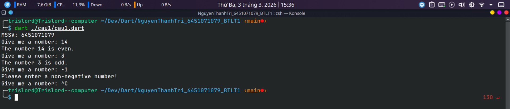

---

### Kết quả câu 2:
Kiểm tra số năm còn lại cho đến lúc 100 tuổi

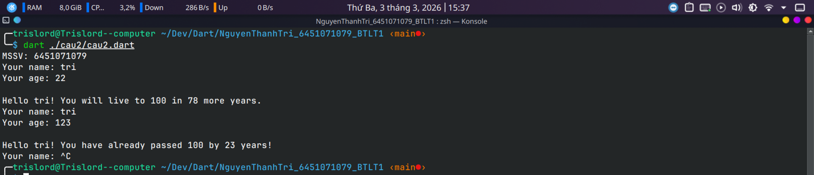

---

### Kết quả câu 3:
Tất cả các phần tử của danh sách nhỏ hơn 5

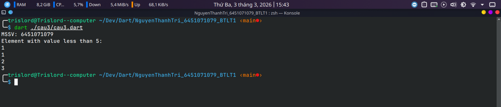

---

### Kết quả câu 4:
Nhập một số và sau đó in ra danh sách tất cả các
ước của số đó

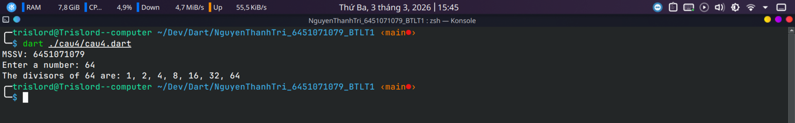

---

### Kết quả câu 5:
Lấy hai danh sách, ví dụ: a = [1, 1, 2, 3, 5, 8, 13, 21, 34, 55, 89] và b = [1, 2, 3, 4, 5, 6, 7, 8, 9, 10, 11, 12, 13]. Viết chương trình trả về một danh sách chỉ chứa các phần tử chung giữa chúng (không trùng lặp). Đảm bảo rằng chương trình của bạn hoạt động trên hai danh sách có kích cỡ khác nhau.

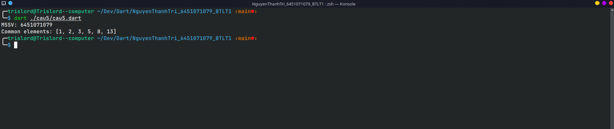

---

### Kết quả câu 6:
Yêu cầu người dùng cung cấp một chuỗi và in ra xem chuỗi này có phải là một chuỗi Palindrome hay không. Palindrome là một chuỗi đọc xuôi và ngược giống nhau.

---

### Kết quả câu 7:
Giả sử bạn được cung cấp một danh sách được lưu trong một biến: a = [1, 4, 9, 16, 25, 36, 49, 64, 81, 100]. Viết mã Dart lấy danh sách này và tạo một danh sách mới chỉ có các phần tử chẵn của danh sách này trong đó.

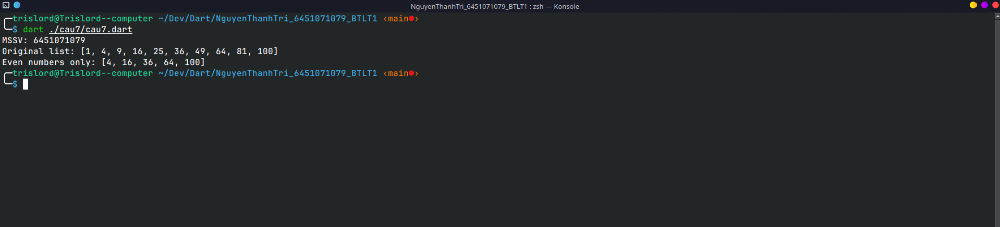

---

### Kết quả câu 8:
Tạo một số ngẫu nhiên trong khoảng từ 1 đến 100. Yêu cầu người dùng đoán số, sau đó cho họ biết họ đã đoán quá thấp, quá cao hay chính xác. Theo dõi xem người dùng đã đoán được bao nhiêu lần và khi trò chơi kết thúc, hãy in thông tin này ra.

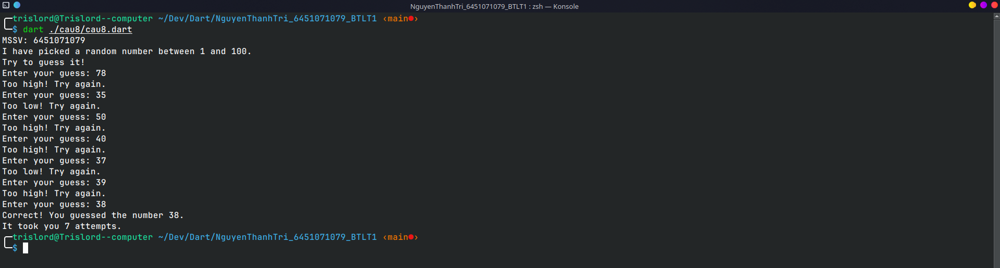

---

### Kết quả câu 9:
Hỏi người dùng một số và xác định xem số đó có phải là số nguyên tố hay không.

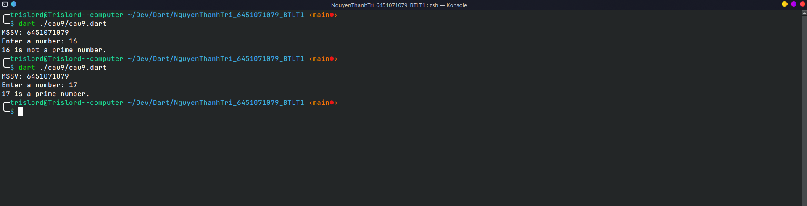

---

### Kết quả câu 10:
Viết chương trình lấy một danh sách các số chẳng hạn a = [5, 10, 15, 20, 25] và tạo một danh sách mới chỉ gồm các phần tử đầu tiên và cuối cùng của danh sách đã cho.

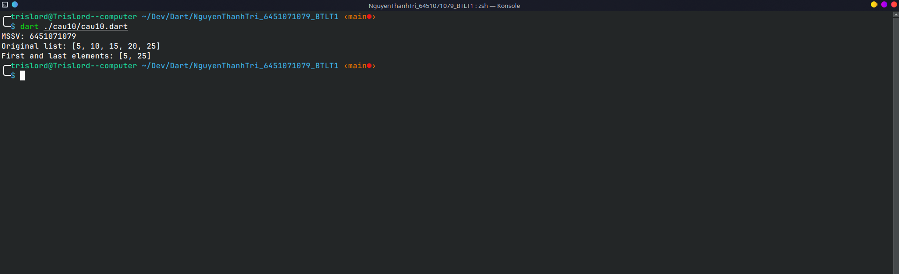

---

### Kết quả câu 21:
Viết một chương trình Dart để tạo một lớp Laptop với các thuộc tính [id, name, ram]. Tạo 3 đối tượng từ lớp này và in ra tất cả thông tin của chúng.

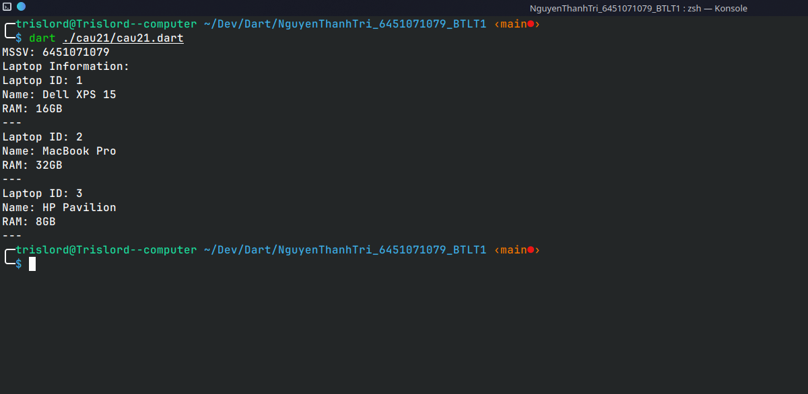

---

### Kết quả câu 22:
Viết một chương trình Dart để tạo một lớp House với các thuộc tính [id, name, price]. Tạo constructor cho lớp này và tạo 3 đối tượng từ nó. Thêm các đối tượng đó vào một danh sách (list) và in ra toàn bộ thông tin.

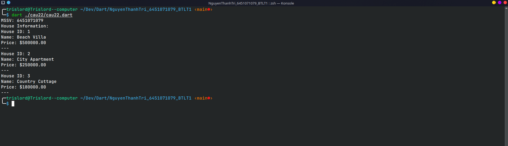

---

### Kết quả câu 23:
Viết một chương trình Dart để tạo một enum cho giới tính [male, female, others] và in ra tất cả các giá trị của enum đó.

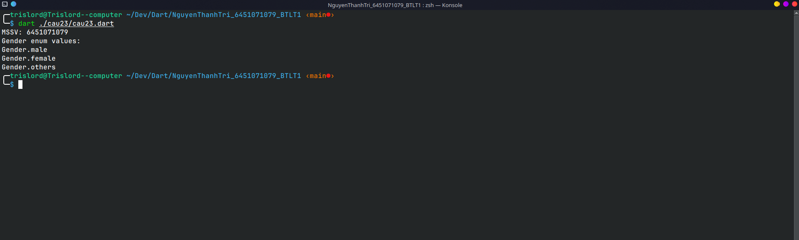

---

### Kết quả câu 24:
Viết một chương trình Dart để tạo một lớp Animal với các thuộc tính [id, name, color]. Tạo một lớp khác tên là Cat và kế thừa (extends) từ lớp Animal. Thêm một thuộc tính mới sound kiểu String. Tạo một đối tượng Cat và in ra toàn bộ thông tin.

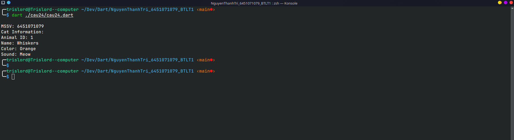